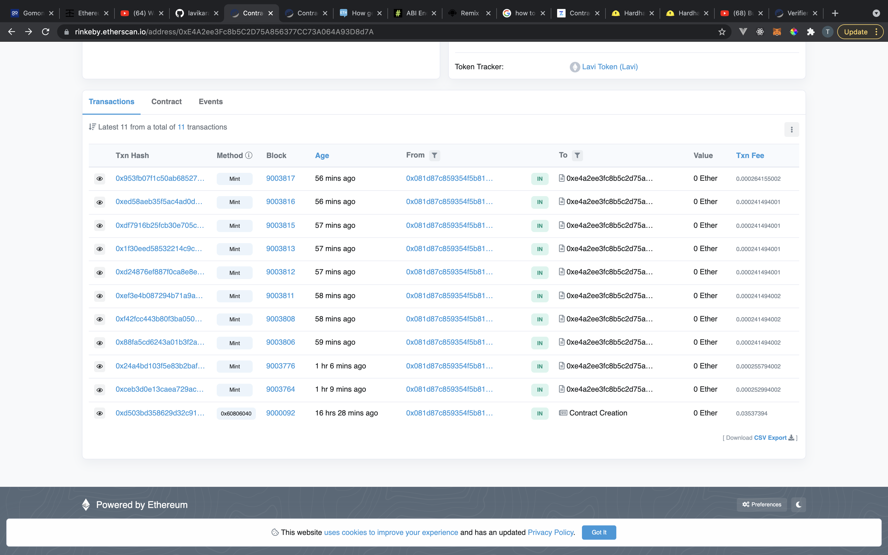

# Udacity Blockchain Capstone

The capstone will build upon the knowledge you have gained in the course in order to build a decentralized housing product.

### Install dependencies

```
npm install
```

### Project directory

```
cd eth-contracts
```

### Compile contract

```
truffle compile
```

### Deploy contract to local blockchain

```
truffle migrate
```

### Test Contract

```
truffle test
```

### Test Results

```
> Compiling ./contracts/ERC721Mintable.sol
> Compiling ./contracts/SolnSquareVerifier.sol
> Compilation warnings encountered:
> Artifacts written to /var/folders/r1/dztf05715vq023f0f_pqv4340000gn/T/test--40112-8EHav9qqUzsO
> Compiled successfully using:
   - solc: 0.5.16+commit.9c3226ce.Emscripten.clang

  Contract: TestERC721Mintable
    match erc721 spec
      ✓ should return total supply (53ms)
      ✓ should get token balance (45ms)
      ✓ should return token uri (162ms)
      ✓ should transfer token from one owner to another (178ms)
    have ownership properties
      ✓ should fail when minting address is not contract owner (268ms)
      ✓ should return contract owner

  Contract: TestSolnSquareVerifier
    SolnSquareVerifier Test
      ✓ should mint token for contract (852ms)
      ✓ should add new solution (43ms)
      ✓ should not mint if proof has already been used (72ms)

  Contract: TestSquareVerifier
    Verifier Test
      ✓ should verify correct proof (536ms)
      ✓ should not verify incorrect proof (508ms)


  11 passing (8s)
```

## Contract address on rinkeby

### 1. Verifier

- transaction hash: 0x15ec31a1047f6908c96271e22a36301a8c944efbf7239c7afa440871e24f67aa
- contract address: 0x6eEc3f9314EC493080e7678EfF3785532361cA03

---

### 2. SolnSquareVerifier

- transaction hash: 0xd503bd358629d32c912a0b373d8e8ebd184c53fb525490bd96a1bccf0dc4506c
- contract address: 0xE4A2ee3Fc8b5C2D75A856377CC73A064A93D8d7A

---

## Contract ABI

- [verifier ABI](https://github.com/lavikara/real-estate-marketplace/blob/master/eth-contracts/artefacts/verifier.json)

- [solnSquareVerifier ABI](https://github.com/lavikara/real-estate-marketplace/blob/master/eth-contracts/artefacts/solnSquareVerifier.json)

## Opensea marketplace

- [Opensea market place](https://testnets.opensea.io/collection/lavi-token-v2)

## Mint transactions on rinkeby etherscan



## Buy transactions on rinkeby etherscan


### Libaries

```
  "dependencies": {
    "dotenv": "^10.0.0",
    "openzeppelin-solidity": "^2.2.0",
    "solc": "^0.5.2",
    "solc-js": "^0.5.2",
    "truffle-hdwallet-provider": "^1.0.17"
  }
```

# Project Resources

- [Remix - Solidity IDE](https://remix.ethereum.org/)
- [Visual Studio Code](https://code.visualstudio.com/)
- [Truffle Framework](https://truffleframework.com/)
- [Ganache - One Click Blockchain](https://truffleframework.com/ganache)
- [Open Zeppelin ](https://openzeppelin.org/)
- [Interactive zero knowledge 3-colorability demonstration](http://web.mit.edu/~ezyang/Public/graph/svg.html)
- [Docker](https://docs.docker.com/install/)
- [ZoKrates](https://github.com/Zokrates/ZoKrates)
